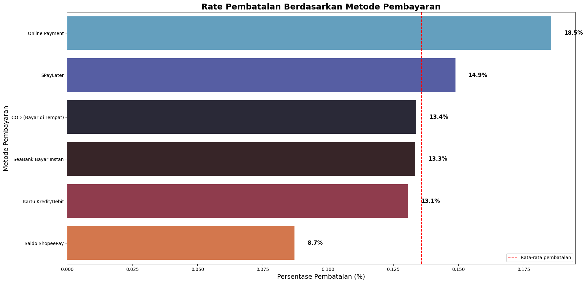
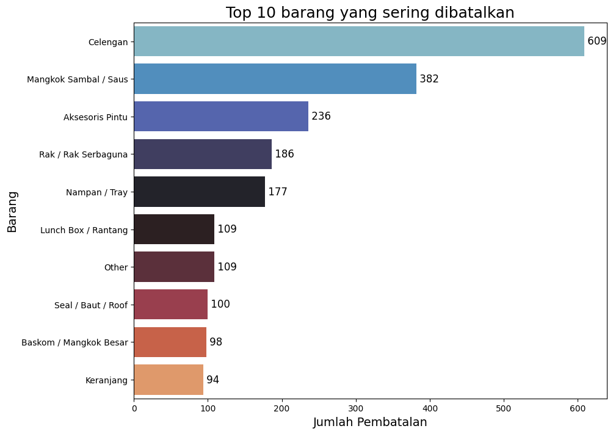
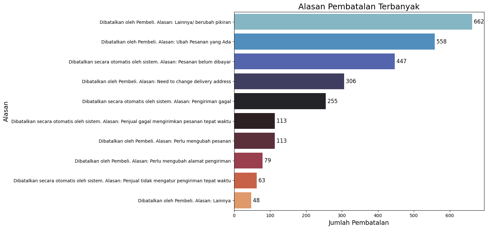
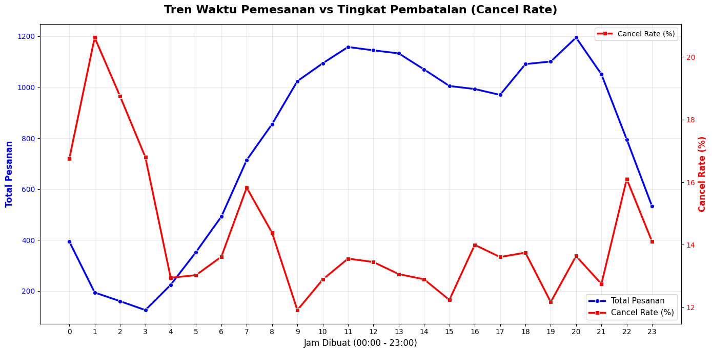
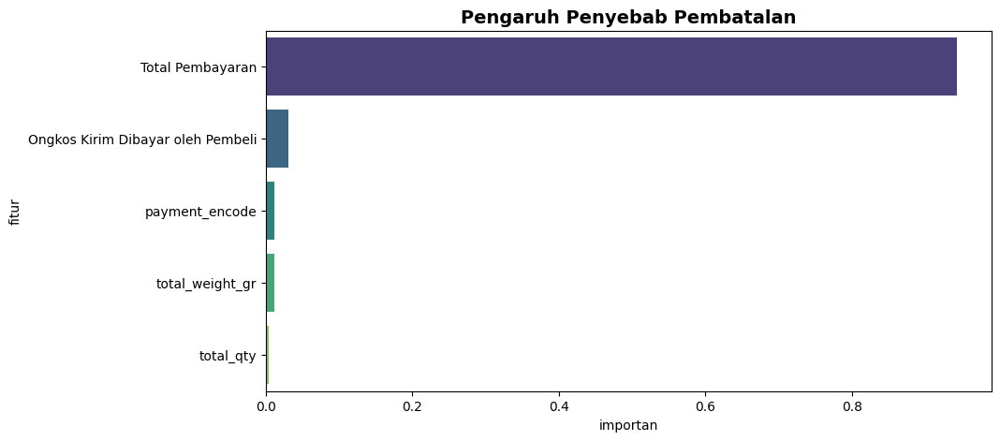

# E-Commerce Customer Analysis
Dalam industri e-commerce yang bergerak sangat cepat, memahami perilaku dari pelanggan adalah kunci untuk menjaga profitabilitas. Salah satu tantangan terbesar yang sering dihadapi oleh platform belanja online adalah tingginya tingkat pembatalan pesanan. Dampak dari pembatalan tidak hanya pada potensi pendapatan, tetapi juga dapat mengganggu rantai pasok logistik. Berangkat dari hal tersebut saya akan mencoba menemukan insight mengenai faktor apa saja yang memicu pelanggan membatalkan pesanan mereka. Data yang digunakan pada merupakan data sekunder yang diambil dari [kaggle](https://www.kaggle.com/datasets/bakitacos/indonesia-e-commerce-sales-and-shipping-20232025/data). 

Berikut beberapa temuan:

Untuk penjelasan lebih lengkap dapat dilihat pada artikel di [Medium](https://medium.com/@evanarya32/mengungkap-pola-pembatalan-pesanan-pada-e-commerce-pendekatan-data-driven-dashboard-penjualan-d6c27690ad5a) yang saya tulis. Saya juga membuat dashboard penjualan dengan menggunakan data yang sama pada looker studio, berikut link nya: [Dashboard Penjualan](https://datastudio.google.com/reporting/c2379876-033e-400d-8a4a-a2f4e3d5b6ca).